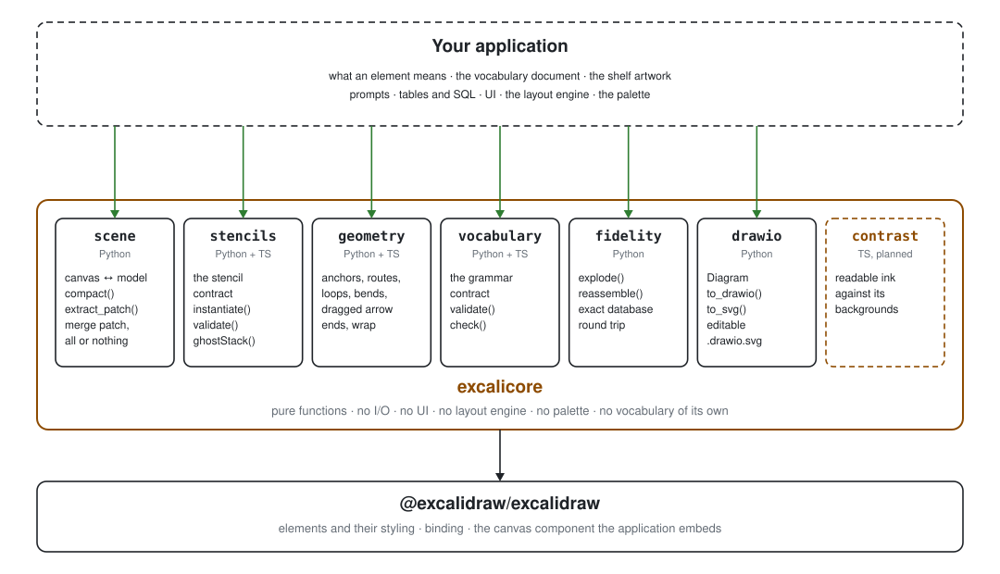

# excalicore

The parts of an Excalidraw-backed application that are the same in every
Excalidraw-backed application.



Excalidraw is a canvas library. It hands you an array of elements and leaves
everything else to you — and "everything else" turns out to be the same short
list of problems each time: how to show a board to a language model without
drowning it in bookkeeping, how to accept the model's answer without letting a
garbled reply wreck the canvas, how to store elements in a database and get
them back unbroken, how to declare the symbols and the rules of a domain so
they can be checked, how to route an arrow and keep it routed when a person
drags it, and how to hand the result to draw.io.

None of that is application logic, but all of it is subtle enough to get wrong
quietly. This package is that list, solved once. It comes in two halves from
one repository and one tag: a Python package for the server and a TypeScript
package for the browser, held to the same shared corpus.

## `excalicore.scene` — between a canvas and a language model

A raw Excalidraw scene is far too wide to put in a prompt, and most of its
width is bookkeeping a model must never author. `compact()` projects it onto a
prompt-sized *skeleton dialect*:

- text bound to a container folds into that container's `label`, so an echoed
  label cannot detach from its shape or duplicate;
- arrow bindings become `start`/`end` id references, and their raw points are
  dropped, because bound arrows are re-routed on conversion anyway;
- freehand strokes become a bounded, simplified polyline in absolute board
  coordinates, so a 900-point scribble costs no more than a 40-point one;
- grouped symbols appear as a single entry, addressable by the group id rather
  than as the dozen primitives they are drawn from;
- images and other content a model cannot faithfully re-emit appear as
  read-only geometry: visible and deletable, but not re-drawable.

`extract_patch()` handles the return trip. A reply is prose that may end in one
JSON object, and that object is a **merge patch** — added or changed elements
plus ids to delete — never a whole board. The inversion is the point: with a
patch, a lazy partial reply is correct behaviour and destruction requires
explicit intent, where a whole-board reply silently deletes everything the model
forgot to mention.

Validation is strict all-or-nothing. One malformed element, or a single
coordinate far enough out to be a hallucination rather than a layout, rejects
the entire patch. A half-garbled reply can never half-apply.

## `excalicore.stencils` — the contract a vocabulary element keeps (both halves)

An application has a graphical vocabulary — a data store, a person, a server.
What such an element *means* belongs to the application; what it looks like
belongs to whoever drew it; what it must *provide* — one bindable body, a
frame back to the subject's box, a label slot, decorations anchored to the
body, one group, one tag namespace — is the contract in
`typescript/src/stencils.ts`. `instantiate()` places a stencil so that
`frameOf()` gives the subject's box back; `fromLibraryItem()` turns a symbol
drawn on any canvas into one; `sweep()` removes an instance whole. The Python
`excalicore.stencils` holds the same validator and the same derivations
(`validate`, `default_roles`, `from_library_item`, `subject_box`), so a server
can refuse a symbol at import time with a sentence — both halves are tested
against `corpus/stencils`. See `typescript/README.md` and `docs/design.md`.

## `excalicore.geometry` — what an arrow and a label do once the boxes are placed (both halves)

Every Excalidraw-backed application ends up answering the same three
questions once its boxes are on the sheet: where does an arrow between two
boxes go, how does an arrow the user bent survive the boxes moving, and how
does a label stay legible. `geometry` is the lowest module in the package —
`stencils` and `scene` import their box arithmetic from it rather than
carrying their own copy. It holds box arithmetic (`boxOf`/`box_of`,
`union`, `centre`, `contains`, `overlap`, `area`); faces and anchors
(`facingSides`/`facing_sides`, `pointOnSide`/`point_on_side`, `along`,
`anchorUV`/`anchor_uv`, `anchorXY`/`anchor_xy`, `exitT`/`exit_t`,
`centreSegment`/`centre_segment`); a loop off a box's own corner for a
connector whose kind allows one (`loopRoute`/`loop_route`,
`loopSides`/`loop_sides`); shape memory — a hand-bent route
remembered relative to its own chord so a right angle stays a right angle
when a box moves (`relativeBends`/`relative_bends`,
`absoluteRoute`/`absolute_route`), and an arrow's kind read out of
Excalidraw's two unrelated fields (`arrowKind`/`arrow_kind`,
`arrowFields`/`arrow_fields`, `arrowElement`/`arrow_element`); and greedy
word-wrap to a column budget (`wrap`, `ellipsise`, `terse`,
`lineCount`/`line_count`); and what happens to an arrow once a person has
dragged it (`RELEASE_TOLERANCE`, `originAtFirstPoint`/`origin_at_first_point`,
`offBox`/`off_box`, `releaseEnds`/`release_ends`, `reboundEnds`/`rebound_ends`).
Both halves are tested against `corpus/geometry`.

**Run every converted element through `originAtFirstPoint` before it reaches
the canvas.** `convertToExcalidrawElements` hands back an arrow bound at both
ends starting half a pixel off its own origin, and Excalidraw 0.18's point
editor multiplies that offset by 4096 when the user drags the arrow's end: the
arrow is clipped out of its own render cache and vanishes from the board.

`releaseEnds` and `reboundEnds` are for an application whose arrows stand for
something in a model of its own. An end dropped in empty space (further than
`RELEASE_TOLERANCE` from its box) is a slip, and `releaseEnds` puts it back on
the anchor the application supplies; an end dropped on a *different* box means
the drawing now disagrees with the model, and `reboundEnds` says which end and
to whom — resolving any element of a multi-element symbol to the symbol
through the application's own `ownerOf` map. Whether to put the end back, ask
the user or accept it is the application's decision. In the browser,
`replaceArrows` swaps a few arrows (and their bound labels) for fresh copies
and re-seats the boxes' `boundElements`, so a declined change can be undone
without repainting the whole board. The TypeScript half additionally exports
`normalizeBoundArrows` and `topAlignCrowdedLabels` — the pass a sketch
application runs in the browser between a model's reply and
`convertToExcalidrawElements`; no server has a use for them, so there is no
Python twin. The layout *engine* — where a box goes, how a route is chosen
among several — stays with the application; this module is what the engine
is built out of.

## `excalicore.vocabulary` — the form of an application's grammar (both halves)

An application has a vocabulary: its kinds, which are containers, which are
connectors, what may sit inside what and what may join what. `validateVocabulary()`
(`validate` in Python) checks a vocabulary document — every kind has a name
and a role, `within` and `ends` name real kinds of the right role, `placed`,
`directed`, `loops` and `parallel` hold their allowed values. `checkGraph()`
(`check`) checks a graph — the subjects and connections of one model, in the
neutral shape the checker reads — against an already-valid vocabulary:
declared once, of a known kind and role, containment honoured and free of
cycles, every connection's ends on the board, of an allowed pair of kinds,
and not a loop or a parallel where the kind forbids it. `kindsOf`/`kindOf`/
`stencilFor` (`kinds`/`kind`/`stencil_for`) are the lookups a picker, a
renderer or a server's delta gate need. Excalicore never holds a particular
vocabulary — what a data store *means* stays with the application; both
halves are tested against `corpus/vocabularies`.

## `excalicore.fidelity` — storing elements without breaking them

An element carries fields no application should author and none may discard.
`seed` and `versionNonce` feed the rough-renderer and the conflict resolver,
`version` and `updated` order concurrent edits, `index` fixes z-order, and
`boundElements` holds the back-references that keep labels attached to shapes.

Normalize one away and the canvas does not raise. It fails **silently**: a
label detaches, a shape re-renders with a different hand, an edit is quietly
dropped on the next merge. The damage surfaces days later, in a board nobody
was watching.

So `explode()` extracts only the few fields worth querying — id, type, and
bounds — and keeps everything else verbatim; `reassemble()` is its exact
inverse. The verbatim remainder is the arbiter, which makes the round trip
exact by construction rather than by an ever-growing list of fields somebody
has to remember to update. A key the element never carried is not invented, a
key it set to null is not lost, and a field added by a future Excalidraw
release passes through untouched.

`file_ids()` and `unreferenced_files()` give asset collection its roots.
Deleted elements count as references: Excalidraw keeps them in the array so
undo can restore them, and an undo that restores an image whose file was
collected restores a broken image.

## `excalicore.drawio` — a diagram as a draw.io file (Python)

Some boards have to leave the application: into a wiki, a design review, a
document someone else edits. draw.io is what those places read. `Diagram` is
a small builder the application drives **from its own model**, not from the
Excalidraw scene: containers, boxes (`rect`, `cylinder`, `actor`) and arrows
at absolute coordinates, each with draw.io style properties passed through.
Working from the scene would mean guessing back which box a region contains
and which two boxes an arrow joins; the model already knows.

The builder does the parts that are easy to get quietly wrong. A cell inside
a container is stored relative to it, and written after it, because draw.io
resolves a parent by id as it reads. An edge names its source and target, so
it stays attached when a box is dragged; its ends are pinned to where they
meet the boxes and every point between becomes a waypoint, so a bent route
survives. `to_drawio()` writes an uncompressed `mxfile`. `to_svg()` writes a
picture drawn to the same styles with the `mxfile` in the root's `content`
attribute, which is draw.io's editable SVG: the editor opens it as the
diagram, and anything else (a wiki without the draw.io app) shows the picture.
Both files were checked by exporting them through the draw.io desktop CLI.

No palette and no mapping from kinds to shapes: those are the application's.

## What is deliberately not here

No UI components, no Excalidraw wrapper, no prompt text, no HTTP layer, no
database schema, no layout engine, no palette, and no shelf of stencils —
the library defines what a stencil must provide and stores none. Every module
is pure functions — no I/O, no framework, and no opinion about what the
elements mean. Your application keeps its own tables, prompts, layout engine,
palette and vocabulary document; excalicore checks the document, it does not
hold one. A `contrast` module (whether a stroke colour is readable against
its backgrounds) is planned for the TypeScript half.

## Install

Python, from the `python/` subdirectory:

```
pip install "excalicore @ git+https://github.com/locupleto/excalicore@v0.11.0#subdirectory=python"
```

TypeScript, from the repository root (npm cannot install a subdirectory of a
git dependency; a `prepare` script builds `typescript/dist` on install):

```json
"excalicore": "github:locupleto/excalicore#v0.11.0"
```

Pin both halves to the same tag, and by tag. Canvas behaviour is the kind of thing that should only ever change
when you decide it does, never on an unrelated `git pull`.

## Use

```python
from excalicore import scene, fidelity
from excalicore.drawio import Diagram

skeleton = scene.compact(elements)            # -> put in the prompt
prose, patch = scene.extract_patch(reply)     # -> patch is None if nothing valid

rows = fidelity.explode(elements)             # -> insert as you like
elements = fidelity.reassemble(rows)          # -> exactly what went in

d = Diagram("My board")
d.container("dmz", "DMZ", (0, 0, 600, 300))
d.vertex("web", ["Web", "nginx"], (40, 60, 160, 70), parent="dmz")
d.vertex("db", ["Orders"], (360, 60, 160, 70), shape="cylinder", parent="dmz")
d.edge("q", "web", "db", [(200, 95), (360, 95)], ["queries"])
d.to_drawio()                                 # -> bytes for a .drawio file
d.to_svg()                                    # -> bytes for a .drawio.svg file
```

```ts
import { instantiate } from 'excalicore/stencils'
import { checkGraph } from 'excalicore/vocabulary'
import { originAtFirstPoint } from 'excalicore/geometry'

const problems = checkGraph(vocabulary, graph)   // -> sentences, [] when it holds
const parts = instantiate(stencil, { x: 300, y: 200 }, { label: 'Orders' })
const safe = convertToExcalidrawElements(parts).map(originAtFirstPoint)
```

Every tuning constant — which fields to keep, which types are read-only, the
polyline budget, the coordinate bound — is a keyword argument with a sensible
default, so a dialect can be adjusted without forking the module.

## Tests

```
cd python && python -m unittest discover -s tests -t .
npm test
```

The suite runs against a corpus of real captured scenes and real model replies
at `corpus/` (scenes, replies, stencils, vocabularies, geometry), shared by
both halves so they agree about the same fixtures. See `corpus/README.md`.

`tests/test_parity.py` is a tool for anyone migrating off their own copy of
this code: point it at your existing implementation and it asserts that this
package produces identical output across the whole corpus. It skips when no
source is configured.

## Status

`0.x` — the API may still change. A module is added here when a second
independent use has proved its shape; until then it stays in the application
that needs it, because a design with one user is not yet a general one.
`drawio` (v0.10.0) is the one exception so far: it arrived with one user, the
Bastion's Confluence export, and a second already named, on the owner's
decision. Its API is deliberately small (containers, boxes, arrows) so that
second use can still reshape it. The arrow-end functions of v0.11.0 are the
second: `originAtFirstPoint` has three users on arrival, but `releaseEnds`,
`reboundEnds` and `replaceArrows` have one (the Bastion's model-backed board),
and were moved here on the owner's decision that every application built on
this library should have them.

## Layout

```
python/       the installable Python package and its tests
typescript/   the browser half — stencils, vocabulary and geometry written, contrast planned; see its README
package.json  the npm package (root, so a git dependency can find it); builds typescript/dist on install
corpus/       golden scenes and model replies, shared by both halves
docs/         design rationale; architecture.py draws architecture.svg
```
